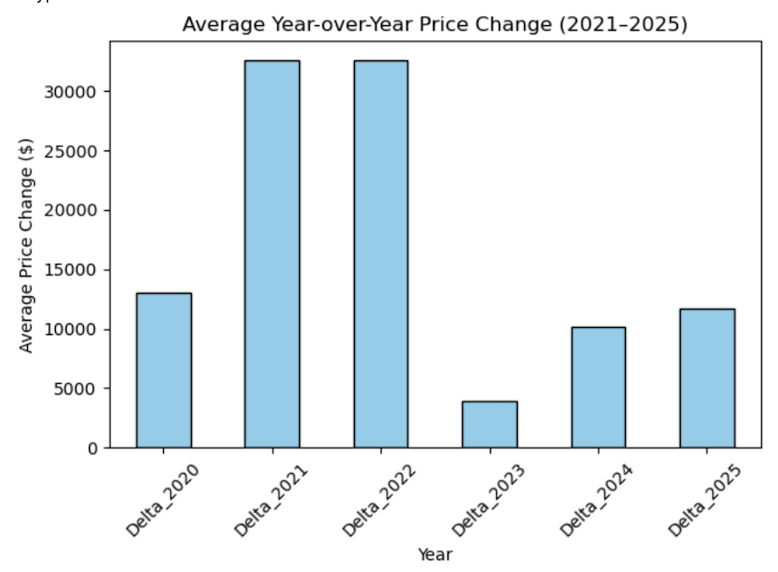

Check out my **ZillowHomeValues_Analysis.ipynb** file for the Python code, and for a deeper analysis of home value prices in the U.S. and Chicago metro area.

# Zillow-Home-Values
Exploratory Data Analysis of Zillow Home Value Index for U.S. cities, 2000 - 2025.
This project uses Zillow Home Value Index data from their website: https.
Data is downloadable in the https://www.zillow.com/research/data/ site, by scrolling down to Data, and selecting ZHVI All Homes (SFR,Condo/Co-op) Time Series, Smoothed, Seasonally Adjusted ($), and filtering for City in the Geography section
I used it to compare average house values during the last 10 years across the country. 

Packages used include Pandas, Numpy, Matplotlib, Seaborn

- I found that LA, Miami, and New York have the highest housing costs
- States like Selma, Alabama and St. Louis , Missouri had the lowest housing costs
  
#### The median house prices dropped in year 2012 and rose more steeply between 2020 and 2022. Since the Covid-19 pandemic, housing costs rose dramatically and have not stopped rising.

#### Immeditaley after the Covid-19 pandemic, in 2020, the avergae delta in price increased by about $19,000, but then dropped after 2022 by about $28,593. This sharp increase and sharp decrease indicates that that home values during the Covid-19 pandemic appracited in value but did not stay that way.

#### In the Chicago-Naperville-Elgin-IL-IN-WI metro area, Illinois had the highest average incraese in home value prices by $50,348.40. That is slightly higher than the average $32,544.77 average incraease for the whole country in 2021. This same location has continued to have an increase in home prices but the increase has declined steadily since 2021.

#### Doing a neeper dive, we can see that tha Chicago and surrounding suburbs area is the only one with a slightly positive correlation to home value prices at (0.54). All other metro areas have aweak negative correlation, with Peoria, IL having the lowest correlation to home value prices at (-0.19), followed by Carbondale-Marion, IL (-0.13) and Ottawa, IL (-0.12).

#### These numbers are not surprising, because Chicago being the largest metro area, and one of the largest cities in the United States, housing is expected to be moderatley pricier than in other metro areas. On the ther hand, Peoria is known to have lower home prices in IL.

#### If I was to take this a step further, I would like to see home value prices by town, and not just metro area. For example, I live in Evanston, IL and most houses in my neighborhood are around a million, but that is not the norm in Naperville or Elgin, where there is plenty of housing below $500,000.

